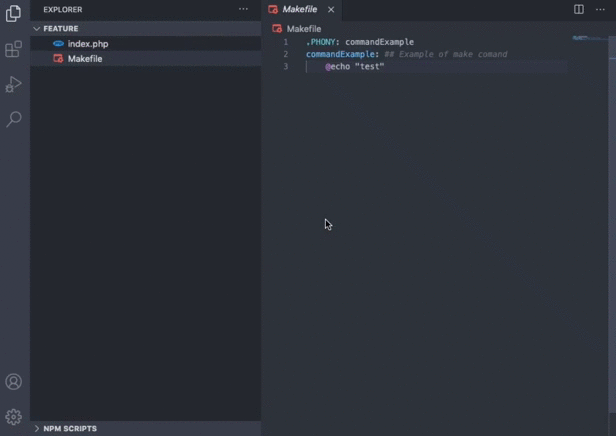

# Makefiles-Runner for VsCode (WIP)

>Make runner for VsCode. Simplify your development by easily running your makefiles commands directly from your IDE interface.

## Usage

- Create your "Makefile" at the root of your project
- Show the Makefiles-Runner panel
- Run any command with one click 🚀
## Feature

Makefile allows you to simply run your makefile commands from the side bar panel.

After configuring the parameters of the extension you can display the "Makefile Commands" panel and see the list of commands in your Makefile, you just have to click on a command to execute it!  

 

## Authors

- [**Akecel**](https://github.com/Akecel) - *Extension author*

## Licence

This project is licensed under the [MIT License](https://opensource.org/licenses)  - see the [LICENSE.md](https://github.com/Akecel/makefiles-runner/blob/master/LICENSE) file for details.

## Show your support

Give a ⭐️ if this project helped you!